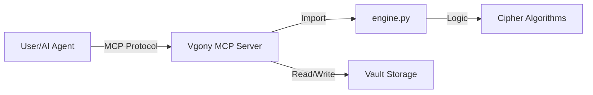

# Project Plan: AI-Powered Vigenère Pipeline

This plan outlines the transformation of the **Vgony Cipher** from a manual CLI tool into an automated AI pipeline component.

## 🎯 Goal
"Deliver the cipher" by exposing the Vigenère/OTP logic as a toolset (MCP Server) that AI agents can use to autonomously encrypt and decrypt communications.

## 🏗️ Architecture

## 📅 Phases

### Phase 1: Core Adaptation (The API)
Ensure the `engine.py` logic is robust enough for "headless" operation (running without a user typing in the console).
- [ ] Review `engine.py` for print statements (replace with return values).
- [ ] Ensure `encrypt_sentence_otp` returns all necessary metadata (keys, mapping) for reconstruction.
- [ ] Add type hints to `engine.py` for clear tool definitions.

### Phase 2: MCP Server Construction
Build a Model Context Protocol (MCP) server that exposes the cipher as executable tools.
- [ ] Create `server.py` using `mcp.server.fastmcp`.
- [ ] **Tool 1**: `encrypt_message(text: str, shift: int = 1) -> JSON`
    - Returns: Encrypted text, generated keys.
- [ ] **Tool 2**: `decrypt_message(ciphertext: str, keys: list[str], shift: int = 1) -> str`
    - Returns: Decrypted plaintext.
- [ ] **Tool 3**: `archive_entry(plaintext: str, ciphertext: str, keys: list[str]) -> str`
    - Saves the operation to a distinct `ai_ops.json` log.

### Phase 3: The Pipeline (Workflow)
Create an automated workflow file that demonstrates the AI using the cipher.
- [ ] Create `.agent/workflows/secure-comms.md`.
- [ ] **Step 1**: AI generates a status report (plaintext).
- [ ] **Step 2**: AI uses `encrypt_message` tool to lock it.
- [ ] **Step 3**: AI writes the *ciphertext only* to a public log file.
- [ ] **Step 4**: AI writes the *keys* to a secure, separate location.

## 🚀 Execution Strategy
1.  **Refine Engine**: Check `engine.py` now.
2.  **Build Server**: Write `server.py`.
3.  **Config**: Add the server to the user's MCP configuration (requires user action/approval).
4.  **Test**: Run a "secure comms" simulation.
