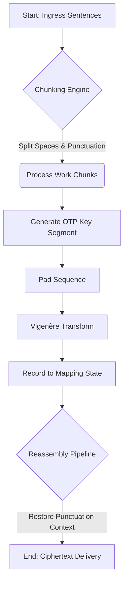

# Crypt Workspace v1.0 🔐

[](https://opensource.org/licenses/MIT)
[](https://python.org)

**A secure, command-line orchestration engine for stateful symmetric encryption.**

---

## �️ System Architecture

Crypt Workspace is designed as a persistent cryptographic engine that orchestrates Vigenère-based One-Time Pad (OTP) encryption. The architecture is built around three core components:

1. **OTP Engine**: Generates unique, non-repeating keys scaled dynamically to chunk lengths.
2. **Vault Storage (State Management)**: A JSON-backed persistence layer that records discrete encryption operational states ("Secret Ops"). 
3. **Bi-Directional Tracing**: Enables cryptographic auditing by tracking exact key-shift mappings applied to character vectors.

The system natively supports linguistic versatility without stripping context, maintaining exact casing and punctuation across Latin, Spanish, and French alphabets during transformation pipelines.

---

## 🚀 Operational Workflow

```bash
# Initialize the workspace environment
python crypt.py
```

### Standard Operating Procedure:
1. **[1] Ingress**: Load plaintext via `msg.txt` or standard input.
2. **[4] Encrypt**: The OTP engine generates cryptographically random key segments and executes the encryption matrix.
3. **[3] Persist State**: Commit the ephemeral operation securely into the `vault/` persistent storage.
4. **[5] Decrypt**: State engine automatically retrieves and applies the associated mapping history to reverse the operation.

---

## 📂 Technical Documentation

- [Architecture Guide & Data Flow](./docs/architecture.md) - Deep dive into mapping logic and execution paths.
- [API Reference](./docs/api_reference.md) - Function-level specifications.
- [ADR-0001: OTP Model Transition](./docs/adr/0001-workspace-and-rotating-keys.md) - Architecture Decision Record on rotating keys vs. repeating structures.
- [Historical Branch](./legacy/README.md) - Original design specifications and prototyping artifacts.

---

## 🏛️ Execution Pipeline



---

## 📄 License

Distributed under the MIT License.
